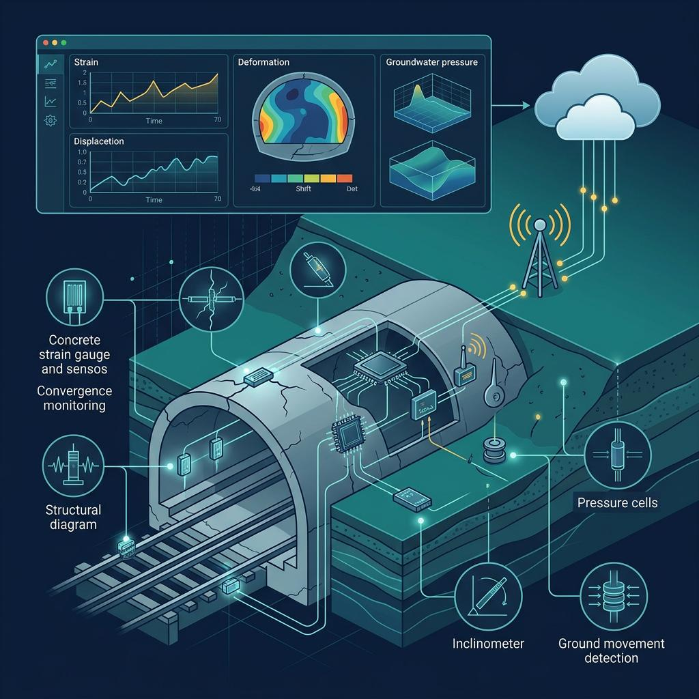

#  Tunnel AI Intelligence

### Real Time AI Powered Tunnel Structural Health Monitoring

<p align="center">
  
  
  
  
  
  
  
</p>

<p align="center">
  <b>12 Sensors • 4 Tunnel Sections • Real-Time Streaming • Fault Detection • AI Anomaly Detection</b>
</p>

---

##  Overview

**Tunnel AI Intelligence** is a Structural Health Monitoring (SHM) prototype that continuously monitors tunnel load sensors, detects faulty readings, calculates reliable section loads, and generates real-time safety alerts.

<p align="center">
  
</p>

```text
Sensor Data
     ↓
Calibration
     ↓
Validity Check
     ↓
Fault Detection
     ↓
Section Averaging
     ↓
Confidence Analysis
     ↓
AI Anomaly Detection
     ↓
Alerts & Events
```

---

##  Monitoring Architecture

```text
              TUNNEL
                 │
     ┌───────────┼───────────┐
     ▼           ▼           ▼
 SECTION A   SECTION B   SECTION C   SECTION D
  A1 A2 A3    B1 B2 B3    C1 C2 C3    D1 D2 D3
     │           │           │           │
     └───────────┴───────────┴───────────┘
                     │
                     ▼
              SHM PROCESSING
                     │
          ┌──────────┴──────────┐
          ▼                     ▼
    Sensor Health          Load Analysis
          │                     │
          └──────────┬──────────┘
                     ▼
                AI ENGINE
                     │
                     ▼
              ALERT SYSTEM
```

---

##  Real-Time Live Monitoring

The CSV acts as a simulated real-time sensor stream.

```text
CSV
 ↓
Timestamp 1
 ↓
Timestamp 2
 ↓
Timestamp 3
 ↓
...
 ↓
Last Timestamp
 ↓
LOOP → Timestamp 1
```

The Live Streaming tab continuously updates a **rolling Plotly waveform** without requiring a manual refresh.

Features:

*  Live sensor streaming
*  Rolling sensor wave
*  Current simulation timestamp
*  Individual sensor selection
*  Tunnel load KPIs
*  Real-time fault alerts

---

##  Sensor Fault Detection

The system identifies:

```text
NORMAL
WARNING
ABNORMAL
SENSOR FAULT
INVALID
CRITICAL
```

Example:

```text
B1 = -8.42 kN  → INVALID
B2 = 103.4 kN  → VALID
B3 = 104.1 kN  → VALID
```

The faulty sensor is automatically excluded:

```text
Section B Average

(103.4 + 104.1) / 2

= 103.75 kN
```

This prevents faulty measurements from corrupting structural calculations.

---

##  Confidence Intelligence

| Valid Sensors            | Confidence  |
| ------------------------ | ----------- |
| 3 / 3                    | 🟢 FULL     |
| 3 / 3 + excessive spread | 🟡 REVIEW   |
| 2 / 3                    | 🟠 DEGRADED |
| 1 / 3                    | 🔴 LOW      |
| 0 / 3                    | 🔴 FAULT    |

---

##  AI / ML Layer

The system can extend deterministic SHM with machine-learning anomaly detection.

### Algorithms

**Isolation Forest**

* Detects unusual sensor behavior and outliers.

**Autoencoder**

* Learns normal sensor patterns.
* High reconstruction error → potential anomaly.

**LSTM / Temporal Models**

* Learns time-dependent structural behavior.
* Compares predicted vs observed load.

```text
Normal Sensor Sequence
          ↓
      ML Model
          ↓
   Expected Behaviour
          ↓
Actual ───────── Expected
          ↓
     Anomaly Score
          ↓
     Risk / Alert
```

---

##  Alert Intelligence

Every fault becomes an event rather than repeatedly generating duplicate alerts.

```text
CRITICAL

Section C — Sensor C3

Reading: -11.42 kN
Reason: Negative Sensor Output
Status: SENSOR FAULT

Start: 10:42:15
End:   10:46:15
Duration: 4 min
```

The event remains available in the **Alerts & Events** history.

---

##  Calibration → Intelligence Pipeline

```text
Raw Value
    ↓
R0 / GF / BF / Thermal Parameters
    ↓
Calibrated Load
    ↓
Validity
    ↓
Sensor Health
    ↓
Section Average
    ↓
Spread %
    ↓
Confidence
    ↓
AI Anomaly Score
    ↓
Alert
```

---

##  Data Architecture

The system intentionally uses **one CSV dataset**:

```text
tunnel_load_monitor_all_data.csv
```

The dataset contains the information required for:

* Sensor readings
* Calibration
* Temperature
* Calibrated load
* Validity
* Fault detection
* Section averaging
* Sensor health

No separate sensor/fault/alert CSV files are required.

---

##  From Monitoring to Protection

```text
REAL-TIME SENSOR DATA
          ↓
   SENSOR VALIDATION
          ↓
    FAULT DETECTION
          ↓
 STRUCTURAL ANALYSIS
          ↓
   AI ANOMALY MODEL
          ↓
   EARLY WARNING
          ↓
 ENGINEER DECISION
          ↓
INFRASTRUCTURE SAFETY
```

> **TunnelGuard AI is a research/prototype SHM platform designed for early detection and engineering decision support. Real-world tunnel deployment requires certified sensors, validated calibration, engineering thresholds, redundancy, and qualified structural-engineering review.**

---

##  Future

```text
CSV Simulation
      ↓
Real IoT Sensors
      ↓
MQTT / Kafka
      ↓
Edge Processing
      ↓
Cloud SHM Platform
      ↓
AI Prediction
      ↓
Digital Twin
      ↓
Predictive Infrastructure Safety
```
---

##  Connect With Me

## 🤝 Connect With Me

<p align="center">

<a href="https://www.linkedin.com/in/hovarthan-ai">
  
</a>
&nbsp;&nbsp;&nbsp;

<a href="mailto:hovarthano4@gmail.com">
  
</a>
&nbsp;&nbsp;&nbsp;

<a href="https://github.com/hovarthan21">
  
</a>

</p>

<p align="center">
  <b>AI Engineer • Machine Learning • Software Development </b>
</p>

<p align="center">
  Building intelligent systems that connect <b>AI + IoT + Engineering</b> to create safer infrastructure.
</p>

<p align="center">
  ⭐ If you found this project interesting, consider starring the repository!
</p>


